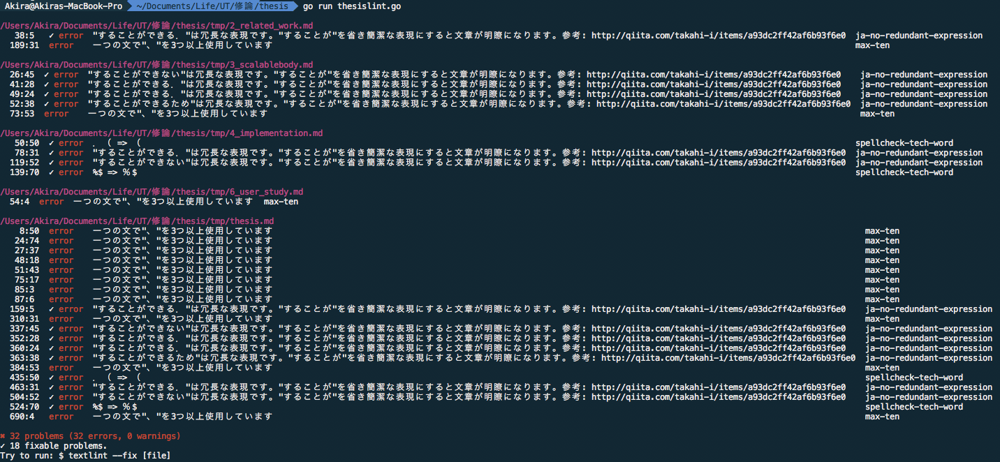

# thesislint



.texファイルに記述された文章の表現をチェックします。

## 使い方

### 1. textlintをインストールする

```
npm i textlint
npm i textlint-rule-max-ten textlint-rule-spellcheck-tech-word textlint-rule-no-mix-dearu-desumasu textlint-rule-ja-no-redundant-expression textlint-rule-no-doubled-joshi textlint-rule-no-double-negative-ja textlint-rule-ja-no-abusage textlint-rule-no-dropping-the-ra textlint-rule-no-doubled-conjunctive-particle-ga textlint-rule-no-doubled-conjunction textlint-rule-ja-hiragana-keishikimeishi textlint-rule-ja-hiragana-fukushi textlint-rule-ja-hiragana-hojodoushi textlint-rule-general-novel-style-ja
```

### 2. pandocをインストールする

[ここ](http://pandoc.org)

### 3. texファイルをcloneしたディレクトリにコピーし、`go run thesislint.go`を実行する

```
go run thesislint.go
```

### 4. 自戒の念を込めて文章を修正する

表示される行番号は`thesislint_tmp/`以下のMarkdownファイルのものであることに注意